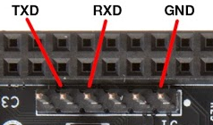
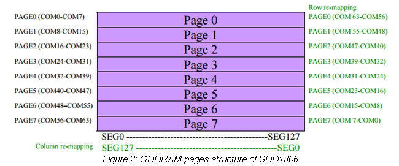
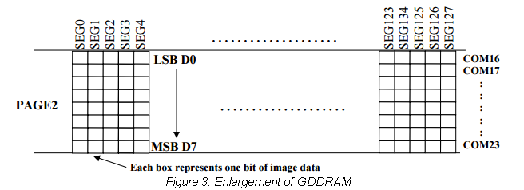
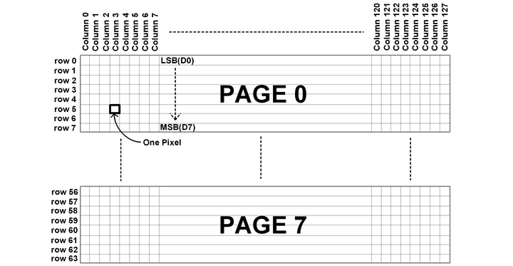
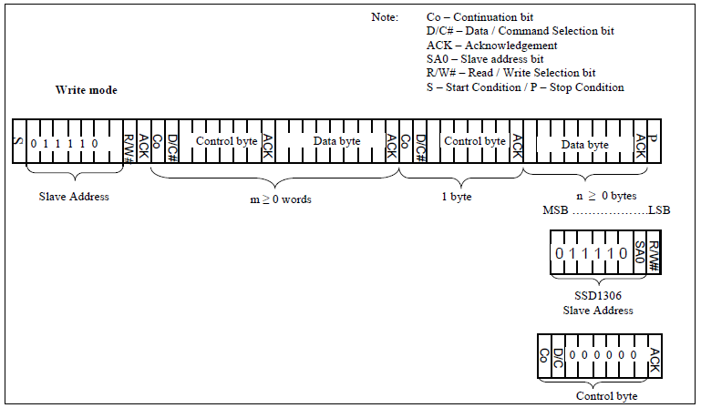
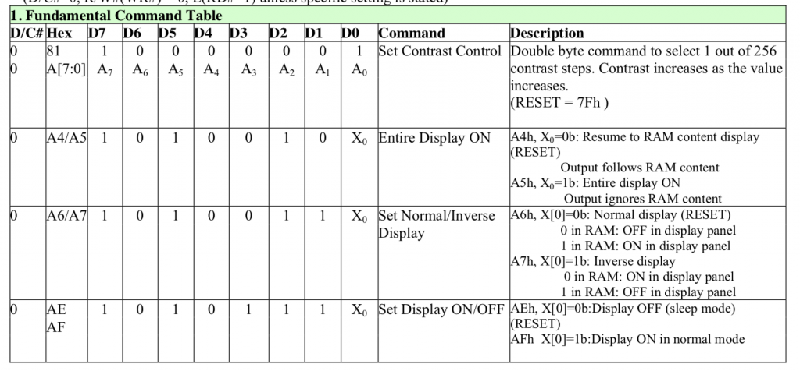
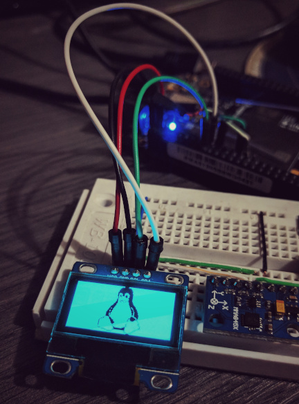

# Implementación de un módulo de kernel para el SSD1306 sobre la BeagleBone Black Wireless
> Este trabajo práctico se desarrollo como parte de la materia "Implementación de Manejadores de Dispositivos" de la Maestría en Sistemas embebidos de la UBA

**A continuación se relatan todos los pasos llevados a cabo para el desarrollo del presente TP**

Para el desarrollo del presente trabajo se tomo como referencia los *Slides*  y los *labs* de bootlin/training-materials y como sistema operativo *host* manjaro con kernel `4.19.62-1-MANJARO`

# Descargando el material para la práctica
```bash
cd ~
wget https://bootlin.com/doc/training/linux-kernel/linux-kernel-labs.tar.xz
tar -xvJf linux-kernel-labs.tar.xz
sudo mv linux-kernel-labs/ /opt/
cd /opt/linux-kernel-labs/
wget https://bootlin.com/doc/training/linux-kernel/linux-kernel-slides.pdf
wget https://bootlin.com/doc/training/linux-kernel/linux-kernel-labs.pdf
```

# Compilando el Kernel de Linux para la BBW

1. Descargando el código
```bash
mkdir -p /opt/linux-kernel-labs/src
cd /opt/linux-kernel-labs/src/
git clone git://git.kernel.org/pub/scm/linux/kernel/git/torvalds/linux.git
cd linux/
git remote add stable git://git.kernel.org/pub/scm/linux/kernel/git/stable/linux-stable.git
git fetch stable
cd /opt/linux-kernel-labs/src/linux
git checkout -b 4.19.y stable/linux-4.19.y
```
2. Configurando entorno y fuentes
```bash
yay -Syu arm-linux-gnueabihf-gcc
export ARCH=arm
export CROSS_COMPILE=arm-linux-gnueabi-
cd /opt/linux-kernel-labs/src/linux
make omap2plus_defconfig
make menuconfig
```
> En manjaro la instalación del paquete `arm-linux-gnueabihf-gcc` toma bastante tiempo, pues se compila desde los fuentes (AUR) y se hace en tres etapas (stage1, stage2 y final)

Dentro de `menuconfig` asegurarse de ajustar las opciones correspondientes para que las siguientes opciones queden así: (usar la función de búsqueda ayuda bastante)

```makefile
CONFIG_USB_GADGET=y
CONFIG_USB_MUSB_HDRC=y
CONFIG_USB_MUSB_GADGET=y
CONFIG_USB_MUSB_DSPS=y
CONFIG_AM335X_PHY_USB=y
CONFIG_USB_ETH=y
CONFIG_PROVE_LOCKING=n
CONFIG_ROOT_NFS=y
```
> Estas opciones son necesarias para poder usar la emulación de Ethernet sobre el puerto usb de la BBW y montar el sistema de archivos vía NFS.

Salir guardando los cambios y verificar por ejemplo con `cat .config | grep CONFIG_USB_GADGET` que las opciones sean correctas.

3. Compilar el kernel y los DTB
```bash
make ARCH=arm CROSS_COMPILE=arm-linux-gnueabihf- -j4
```

> En caso de falla es bueno guardar un log de la compilación, para ello puede agregar lo siguiente al final del comando make: ` 2>&1 | tee kernelBuild.log`

# Configurando el servidor TFTP

El servidor TFTP se usa para transferir la imagen del kernel compilada y el DTB a la BBW. Los pasos a seguir son:
 - Instalar tftp-hpa
 - Iniciar el servicio
 - Poner un archivo de prueba en la carpeta del servidor
 - Copiar la imagen del kernel compilada y el DTB a la carpeta del servidor

```bash
sudo pacman -S tftp-hpa
sudo chmod 777 /srv/tftp
sudo systemctl start tftpd
echo "TesT BBW" > /srv/tftp/test.txt
cd /opt/linux-kernel-labs/src/linux
cp arch/arm/boot/zImage /srv/tftp/
cp arch/arm/boot/dts/am335x-boneblack-wireless.dtb /srv/tftp/
```

# Configurando el servidor NFS

Ya que el sistema de archivos reside en el PC host, es necesario tener un servidor NFS para que el kernel pueda montar el sistema de archivos en la BBW. Los pasos a seguir son:

 - Instalar el software de NFS
 - configurar el servidor
 - Verificar configuración
 - Iniciar el servicio

```bash
sudo pacman -S  nfs-utils
sudo echo "/opt/linux-kernel-labs/modules/nfsroot/ 192.168.1.10(rw,no_root_squash,no_subtree_check)" >> /etc/exports
cat /etc/exports
sudo systemctl start nfs-server
```

> La dirección IP `192.168.1.10` corresponde a la IP que se le va a asignar a  la BBW

# Configurar la Placa de red en el PC Host

Debido a que se va a emular una conexión Ethernet sobre USB, es necesario preconfigurar esta interfaz para que cuando el dispositivo sea detectado, éste ya tenga las configuraciones necesarias. Con el siguiente comando se crea la placa de red con dirección IP `192.168.1.1` y dirección MAC `f8:dc:7a:00:00:01` correspondiente al PC Host

```
nmcli con add type ethernet ifname temp ip4 192.168.1.1/24 mac f8:dc:7a:00:00:01 gw4 192.168.1.1
```

# Configurando la BBW

 - Conectar el cable USB-Serial a los pines correspondientes de la BBW y al PC host



 - Inicial una consola serial sobre el puerto creado por el conversor USB-Serial a 115200n8 `screen /dev/ttyUSB0 115200`
 - Conectar el cable USB mini a la board y al compu (Para el Ethernet over USB )
 - Estar pendiente de presionar la barra espaciadora cuando aparezca el mensaje `Press SPACE to abort autoboot`
 - La salida de la consola debe verse algo parecido a esto:

```
U-Boot SPL 2018.09-00002-g0b54a51eee (Sep 10 2018 - 19:41:39 -0500)
Trying to boot from MMC2
Loading Environment from EXT4... Card did not respond to voltage select!

U-Boot 2018.09-00002-g0b54a51eee (Sep 10 2018 - 19:41:39 -0500), Build: jenkins-github_Bootloader-Builder-65

CPU  : AM335X-GP rev 2.1
I2C:   ready
DRAM:  512 MiB
No match for driver 'omap_hsmmc'
No match for driver 'omap_hsmmc'
Some drivers were not found
Reset Source: Power-on reset has occurred.
RTC 32KCLK Source: External.
MMC:   OMAP SD/MMC: 0, OMAP SD/MMC: 1
Loading Environment from EXT4... Card did not respond to voltage select!
Board: BeagleBone Black
<ethaddr> not set. Validating first E-fuse MAC
BeagleBone Black:
Model: BeagleBoard.org BeagleBone Black Wireless:
BeagleBone: cape eeprom: i2c_probe: 0x54:
BeagleBone: cape eeprom: i2c_probe: 0x55:
BeagleBone: cape eeprom: i2c_probe: 0x56:
BeagleBone: cape eeprom: i2c_probe: 0x57:
Net:   eth0: MII MODE
Could not get PHY for cpsw: addr 0
cpsw, usb_ether
Press SPACE to abort autoboot in 2 seconds
=> 
```

Ya en la consola del U-Boot se procede a realizar las configuraciones necesarias para el booteo. Los pasos a seguir son:

 - Configurar la IP de la BBW
 - Configurar la IP del PC Host
 - Configurar las direcciones MAC

```
setenv ipaddr 192.168.1.10
setenv serverip 192.168.1.1
setenv ethact usb_ether
setenv usbnet_devaddr f8:dc:7a:00:00:02
setenv usbnet_hostaddr f8:dc:7a:00:00:01
```

 - Verificar la configuración de red y la conexión al servidor TFTP.  En el U-Boot se debe ejecutar y ver algo como:

```
=> tftp 0x81000000 test.txt

using musb-hdrc, OUT ep1out IN ep1in STATUS ep2in
MAC f8:dc:7a:00:00:02
HOST MAC f8:dc:7a:00:00:01
RNDIS ready
high speed config #2: 2 mA, Ethernet Gadget, using RNDIS
USB RNDIS network up!
Using usb_ether device
TFTP from server 192.168.1.1; our IP address is 192.168.1.10
Filename 'test.txt'.
Load address: 0x81000000
Loading: #
         0 Bytes/s
done
Bytes transferred = 9 (9 hex)

=> md 0x81000000

81000000: 54736554 57424220 0000000a 00000000    TesT BBW........
81000010: 00000000 00000000 00000000 00000000    ................
81000020: 00000000 00000000 00000000 00000000    ................
```

 - Si todo sale bien se procede a cargar la imagen de kernel y el DTB en la memoria RAM

```
tftp 0x81000000 zImage_BBW
tftp 0x82000000 am335x-boneblack-wireless.dtb
```

 - Se configuran los argumentos de booteo y los parámetros que se le van a pasar al kernel

```
setenv bootargs root=/dev/nfs rw ip=192.168.1.10:::::usb0 console=ttyS0,115200n8 g_ether.dev_addr=f8:dc:7a:00:00:02 g_ether.host_addr=f8:dc:7a:00:00:01 nfsroot=192.168.1.1:/opt/linux-kernel-labs/modules/nfsroot,vers=4,tcp nfsrootdebug;
```
> En manjaro el servidor de NFS solo soporta TCP, por lo que es necesario indicarle al kernel que use este protocolo mediante la opción `tcp`

 - Se procede a bootear con el comando `bootz` indicandole la posición en donde esta el kernel y el dtb.

```
bootz 0x81000000 - 0x82000000;
```

Si todo sale bien se debe ver en la consola algo como:

```
[    1.751043] g_ether gadget: Ethernet Gadget, version: Memorial Day 2008
[    1.757842] g_ether gadget: g_ether ready
[    1.767980] hctosys: unable to open rtc device (rtc0)
[    1.774840] IPv6: ADDRCONF(NETDEV_UP): usb0: link is not ready
[    2.286802] g_ether gadget: high-speed config #1: CDC Ethernet (EEM)
[    2.316031] IPv6: ADDRCONF(NETDEV_CHANGE): usb0: link becomes ready
[    2.346735] IP-Config: Guessing netmask 255.255.255.0
[    2.351830] IP-Config: Complete:
[    2.355080]      device=usb0, hwaddr=f8:dc:7a:00:00:02, ipaddr=192.168.1.10, mask=255.255.255.0, gw=255.255.255.255
[    2.365656]      host=192.168.1.10, domain=, nis-domain=(none)
[    2.371556]      bootserver=255.255.255.255, rootserver=192.168.1.1, rootpath=
[    2.379915] wlan-en-regulator: disabling
[   68.362234] VFS: Mounted root (nfs4 filesystem) on device 0:16.
[   68.369667] devtmpfs: mounted
[   68.374314] Freeing unused kernel memory: 1024K
[   68.381656] Run /sbin/init as init process
Starting logging: OK
Initializing random number generator... [   69.578816] random: dd: uninitialized urandom read (512 bytes read)
done.
Starting network...
ip: RTNETLINK answers: File exists
Starting dropbear sshd: [   69.912948] random: dropbear: uninitialized urandom read (32 bytes read)
OK

Welcome to Buildroot
buildroot login: root
#
```

> En mi caso fue necesario configurar una nueva tarjeta de red diferente a la que se uso en el U-Boot, ya que cuando el kernel bootea manjaro lo reconoce una nueva tarjeta, por lo que es necesario configurar en esta nueva tarjeta la dirección ip de host `192.169.1.1`

# Configurar Un Device Tree personalizado

Para que el Kernel de linux reconozca los nuevos dispositivos y después poder cargar los módulos correspondientes, es necesario instanciarlos en el DeviceTree. Para ello se va a crear uno nuevo a partir del que esta por defecto con un nuevo nombre:

```bash
cd /opt/linux-kernel-labs/src/linux/arch/arm/boot/dts/
cp am335x-boneblack-wireless.dts  am335x-boneblack-wireless-custom.dts
```

Se procede a editar el nuevo archivo `am335x-boneblack-wireless-custom.dts`

 - Se configura el pinmux, que lo que hace es activar los pines correspondientes al i2C1 dentro del SoC, ya que por defecto estos están habilitados para otra función. Se tomo como referencia el siguiente archivo `am335x-evm.dts:215`

```json
&am33xx_pinmux {
	i2c1_pins: i2c1_pins {
		pinctrl-single,pins = <
			AM33XX_IOPAD(0x958, PIN_INPUT_PULLUP | MUX_MODE2) /* spi0_d1.i2c1_sda */
			AM33XX_IOPAD(0x95c, PIN_INPUT_PULLUP | MUX_MODE2) /* spi0_cs0.i2c1_scl */
		>;
	};
};
```

 - Se procede ahora a configurar el puerto i2C (Se tomo como referencia el siguiente archivo `am335x-evm.dts:468`):
   - Se referencia el puerto mediante `&i2c1` para así sobre escribir parámetros previamente definidos.
   - Mediante la sentencia `status = "okay";` se activa el puerto
   - Con `clock-frecuency = <400000>;` se configura el puerto a 400Khz
   - Con `pinctrl-0 = <&i2c1_pins>;` se referencia el pinmux previamente configurado
 - Ahora se agregan el dispositivo, para ello es preciso conocer la dirección con la cual está configurado el dispositivo, para este caso el SSD1306 usa la dirección `0x3C`.
   - El nombre se declara de formal personal agregando la dirección después de la @. Es ideal que este nombre no exista previamente para así evitar conflictos.
   - Dentro de cada dispositivo se declara el parámetro `reg` con el contenido de la dirección del dispositivo.
   - Para el parámetro `compatible` se precisa un string en donde se define un identificativo global y uno al dispositivo (puede ser algo como "fabricante,dispositivo"). Este string es fundamental para el kernel pueda linkear el driver respectivo al dispositivo.

```json
&i2c1 {
	status = "okay";
	clock-frecuency = <400000>;
	pinctrl-names = "default";
	pinctrl-0 = <&i2c1_pins>;

	// se declara el dispositivo
	mseSSD1306: mseSSD1306@3c {
		compatible = "trec,mseSSD1306";
		reg = <0x3c>;
	};
};
```
> El contenido de final del dts puede verse en: [am335x-boneblack-wireless-custom.dts](dts/am335x-boneblack-wireless-custom.dts)

 - Para poder compilar el nuevo DTS es necesario incluirlo en el Makefile propio de la carpeta de dts, debería quedar algo así:

```makefile
...
dtb-$(CONFIG_SOC_AM33XX) += \
	am335x-baltos-ir2110.dtb \
	am335x-baltos-ir3220.dtb \
	am335x-baltos-ir5221.dtb \
	am335x-base0033.dtb \
	am335x-bone.dtb \
	am335x-boneblack.dtb \
	am335x-boneblack-wireless.dtb \
	am335x-boneblack-wireless-custom.dtb \
	am335x-boneblue.dtb \
	am335x-bonegreen.dtb \
	am335x-bonegreen-wireless.dtb \
	...
```

 - Se procede ahora a compilar solamente el nuevo DTS:

```bash
cd /opt/linux-kernel-labs/src/linux
make dtbs ARCH=arm CROSS_COMPILE=arm-linux-gnueabi- -j4
```

 - Si todo sale bien, se copia el archivo compilado `.dtb` a la carpeta del servidor TFTP

```bash
cp arch/arm/boot/dts/am335x-boneblack-wireless-custom.dtb /srv/tftp/
```

 - Debido a que se cambio el DeviceTree es necesario reiniciar la placa y repetir el proceso de booteo, teniendo en cuenta de cargar el nuevo `.dtb`

```
tftp 0x82000000 am335x-boneblack-wireless-custom.dtb
```

# Verificando el nuevo Device Tree

Es posible verificar si los dispositivos fueron creados en el device tree del kernel, para este caso se puede ejecutar el comando `find` dentro del directorio `/sys/firmware/devicetree` pasando como parámetro parte del nombre, para este caso se usó el string "mse":

``` bash
find /sys/firmware/devicetree -name "*mse*"
/sys/firmware/devicetree/base/ocp/i2c@4802a000/mseSSD1306@3c
```

Támbien se puede comprobar si la configuración del puerto i2c. Para ello es necesario conectar los dispositivos al conector P9 de la BBW, así:
 - GND al pin 1
 - VCC al pin 3
 - CLK al pin 17
 - SDA al pin 18

Una vez conectados se puede escanear el puerto i2c1 en busca de dispositivos usando el comando `i2cdetect`:

```bash
i2cdetect -r 1
WARNING! This program can confuse your I2C bus, cause data loss and worse!
I will probe file /dev/i2c-1 using read byte commands.
I will probe address range 0x03-0x77.
Continue? [Y/n] 
     0  1  2  3  4  5  6  7  8  9  a  b  c  d  e  f
00:          -- -- -- -- -- -- -- -- -- -- -- -- -- 
10: -- -- -- -- -- -- -- -- -- -- -- -- -- -- -- -- 
20: -- -- -- -- -- -- -- -- -- -- -- -- -- -- -- -- 
30: -- -- -- -- -- -- -- -- -- -- -- -- 3c -- -- -- 
40: -- -- -- -- -- -- -- -- -- -- -- -- -- -- -- -- 
50: -- -- -- -- -- -- -- -- -- -- -- -- -- -- -- -- 
60: -- -- -- -- -- -- -- -- -- -- -- -- -- -- -- -- 
70: -- -- -- -- -- -- -- --                         
```

>  Puede observarse que efectivamente hay un dispositivo en la dirección  `0x3C`

Usando los comandos `i2cget` e `i2cset` se puede interactuar con los dispositivos conectados. El siguiente comando, por ejemplo, se comunica con la pantalla OLED (SSD1306) envaindole todos los comandos de inicialización y la enciende (se vera en la pantalla puntos aleatorios, ya que es el "ruido" presente en la memoria RAM del dispositivo):

```bash
i2cset -y 1 0x3c 0x00 0xAE 0xD5 0x80 0xA8 0x3F 0xD3 0x00 0x40 0x8D 0x14 0x20 0x00 0xA1 0xC8 0xDA 0x12 0x81 0xCF 0xD9 0xF1 0xDB 0x40 0xA4 0xA6 0x2E 0xAF i
```

# Direccionamiento del SSD1306 para una pantalla OLED de 128x64

Antes de programar el driver, hay que entender bien el funcionamiento del chip y como interactua con la pantalla. Lo primero es entender el direccionamiento de la memoria GDRAM, que es en donde se almacena la información correspondiente a lo que se va a visualizar. Para este caso, la memoria de divide en 8 'páginas' enumeradas del 0 al 7 como se observa en la siguiente figura:



Y cada página se divide internamente en 128 segmentos, en donde cada segmento corresponde a una posición de memoria (8 Bits) de la GDRAM así:




Dando como resultado la matriz de **128x(8*8)** píxeles: 128 columnas y 64 filas. 



Eso quiere decir que al escribir un **0xFF** en la primera posición de memoria, lo que se verá en la pantalla será una linea vertical '**|**' de 8 píxeles en la esquina superior izquierda.

Debido a esta organización de la memoria, internamente se usan **dos punteros** para el direccionamiento. Uno hace referencia a la **página** y el otro hace referencia al **segmento**.

# Funcionamiento de la interfaz i2c en el SSD1306

El SSD1306 usa una estructura de trama especial sobre el protocolo I2C, el cual se puede ver gráficamente en la siguiente imagen:



El primer byte, como es establecido por el estándar I2C corresponde a la dirección del esclavo junto con un bit que hace referencia a si se va a escribir o a leer, después de este sigue un byte de control, el cual le indica a la memoria I2C si el payload corresponde a bytes de datos o de comandos, para ello el bit **D/C#** se pone en **1** para datos y en **0** para comandos. En la siguiente tabla se exponen algunos de los comandos a utilizar:



# Implementando el driver de linux

Para la implementación del driver se usa el clásico __*Character Device*__ para definir el dispositivo, esto permite que el kernel exponga el dispositivo como si se tratase de un archivo de texto cualquiera, permitiendo interactuar con él usando funciones estándar para el manejo de archivos.

> Si bien la pantalla a usar es gráfica, el objetivo del driver a desarrollar, se centra en usar ésta, para presentar únicamente caracteres alfanuméricos, y a la vez explorar el uso de los comandos básicos propios de la pantalla.

## Definiciones base en el archivo de cabecera .h

Como la gran mayoría de archivos en C, se usa un archivo **.h** para las definiciones a usar, como lo son los prototipos de las funciones a usar y las constantes. Para este caso se usa el archivo de cabecera para definir varios de los comandos a usar y otras constantes importantes.

```c
#define  DEVICE_NAME "mseSSD1306" // como aparecerá en /dev/mseSSD1306
#define  CLASS_NAME  "i2c"        /// The device class

#define _SSD1306_LCD_WIDTH_      128
#define _SSD1306_LCD_HEIGHT_     64

#define _I2C_BUFFER_MAX_         32

// Comandos SSD1306
#define _SSD1306_NORMALDISPLAY_     0xA6
#define _SSD1306_INVERTDISPLAY_     0xA7
#define _SSD1306_DISPLAYOFF_        0xAE
#define _SSD1306_DISPLAYON_         0xAF
#define _SSD1306_COLUMNADDR_        0x21
#define _SSD1306_PAGEADDR_          0x22
#define _SSD1306_PAGE_SET_          0xB0

// The prototype functions for the character driver
static int     	mseSSD1306_open(struct inode *, struct file *);
static int     	mseSSD1306_release(struct inode *, struct file *);
static ssize_t 	mseSSD1306_write(struct file *, const char *, size_t, loff_t *);
```

Cabe resaltar que se definirán 3 funciones para interactuar con el espacio de usuario, las cuales son **open** para la apertura, **release** para el cierre y la mas interesante **write** para escribir datos en el pantalla. Esta función solo recibirá como parámetros caracteres, los cuales aparecerán directamente en la pantalla.

## Definiciones para la implementación de ioctl

**ioctl** es una llamada especial de Linux que permite a una aplicación en el espacio de usuario controlar o comunicarse con un driver de dispositivo, extendiendo así las funciones básicas de **read** y **write** de datos. Su nombre abrevia la frase
input/output control y para este caso se va a implementar para poder acceder a las funciones propias de la pantalla, las cuales son:

- Borrar
- Ir al Inicio
- Colores Normales
- Colores Invertidos
- Borrar una página
- Direccionar una página

Para ello se anexan las siguientes definiciones al archivo de cabecera:

```c
// ioctl definitions
enum {
	_SSD1306_IOC_CMD_CLEAR_,
	_SSD1306_IOC_CMD_HOME_,
	_SSD1306_IOC_CMD_NORMAL_,
	_SSD1306_IOC_CMD_INVERT_,
	_SSD1306_IOC_CMD_CLR_PAGE_,
	_SSD1306_IOC_CMD_SET_PAGE_,

	_SSD1306_IOC_CMD_MAX_
};

#define _SSD1306_IOC_MAGIC_			'p'
#define _SSD1306_IOC_CLEAR_			_IO(_SSD1306_IOC_MAGIC_, _SSD1306_IOC_CMD_CLEAR_)
#define _SSD1306_IOC_HOME_			_IO(_SSD1306_IOC_MAGIC_, _SSD1306_IOC_CMD_HOME_)
#define _SSD1306_IOC_NORMAL_		_IO(_SSD1306_IOC_MAGIC_, _SSD1306_IOC_CMD_NORMAL_)
#define _SSD1306_IOC_INVERT_		_IO(_SSD1306_IOC_MAGIC_, _SSD1306_IOC_CMD_INVERT_)
#define _SSD1306_IOC_CLR_PAGE_		_IO(_SSD1306_IOC_MAGIC_, _SSD1306_IOC_CMD_CLR_PAGE_)
#define _SSD1306_IOC_SET_PAGE_		_IO(_SSD1306_IOC_MAGIC_, _SSD1306_IOC_CMD_SET_PAGE_)

static long 	mseSSD1306_ioctl(struct file *file, unsigned int cmd, unsigned long args);

```

La macro `_IO` recibe como parámetro un **número mágico** el cual diferencia este set de instrucciones de los otros dentro del kernel, y el otro parámetro es un **numero de comando** el cual identifica a este comando como único dentro del driver, por ello fue que se usó el enum.

## Implementando la fuente 

Dentro del archivo **.h** tambien se incluye el tipo de fuente para la visualización de los caracteres. Para este caso, como cada página tiene 8 pixeles de alto y 128 de largo, se opto por usar una fuente de **8X8** de tal manera que se tiene una pantalla de 16 caracteres de ancho y de 8 de alto.

Para su implementación se uso como base una de las letras de la clásica comodore64 disponibles en este [link](http://kofler.dot.at/c64/) y su definición es básicamente una arreglo que consta de 1024 posiciones, usando 8 Bytes para cada caracter para los primeros 128 caracteres ASCII.

```c
static uint8_t font8x8[1024] =
{
	0x00, 0x00, 0x00, 0x00, 0x00, 0x00, 0x00, 0x00,	// Char 000 (.)
	0x00, 0x00, 0x00, 0x00, 0x00, 0x00, 0x00, 0x00,	// Char 001 (.)
	0x00, 0x00, 0x00, 0x00, 0x00, 0x00, 0x00, 0x00,	// Char 002 (.)
	...
    0x00, 0x00, 0x00, 0x00, 0x00, 0x00, 0x00, 0x00,	// Char 032 ( )
	0x00, 0x00, 0x00, 0x4F, 0x4F, 0x00, 0x00, 0x00,	// Char 033 (!)
	0x00, 0x07, 0x07, 0x00, 0x00, 0x07, 0x07, 0x00,	// Char 034 (")
	...
    0x00, 0x3E, 0x7F, 0x49, 0x45, 0x7F, 0x3E, 0x00,	// Char 048 (0)
	0x00, 0x40, 0x44, 0x7F, 0x7F, 0x40, 0x40, 0x00,	// Char 049 (1)
	0x00, 0x62, 0x73, 0x51, 0x49, 0x4F, 0x46, 0x00,	// Char 050 (2)
	...
    0x00, 0x00, 0x00, 0x41, 0x77, 0x1C, 0x08, 0x00,	// Char 125 (})
	0x00, 0x00, 0x00, 0x04, 0x06, 0x03, 0x01, 0x00,	// Char 126 (~)
	0x00, 0x00, 0x00, 0x00, 0x00, 0x00, 0x00, 0x00	// Char 127 (.)
};
```

## Funciones Propias del driver

Teniendo en cuenta lo expuesto anteriormente de dispone ahora de hacer la implementación de las funciones propias del driver. Para la comunicación con el dispositivo, se usa una función propia del kernel llamada `i2c_smbus_write_i2c_block_data`, la cual recibe como parámetro el dispositivo, el comando, la cantidad de datos a enviar y el puntero a los datos.

La primera función a implementar es la que permite enviar un comando básico al display

```c
static void sentCommandSSD1306( uint8_t ssd1306Command )
{
    uint8_t i2cCommand = 0x00;   // Co = 0, D/C = 0
    i2c_smbus_write_i2c_block_data(mseSSD1306_i2c, i2cCommand, 1, &ssd1306Command);
}
```
Otra función es la que direcciona los dos punteros (página y columna) a la posición de inicio.
```c
// Direcciona en 0,0
static void homeDisplaySSD1306( void )
{
    uint8_t i2cCommand = 0x00;   // Co = 0, D/C = 0
    char initSec[]  = {0x21, 0x00, 0x7F, 0x22, 0x00, 0x07};
    i2c_smbus_write_i2c_block_data(mseSSD1306_i2c, i2cCommand, sizeof(initSec), initSec);
}

```
Para la función de borrar el display, lo que se hace es escribir `0x00` a lo largo de toda la memoria del display.
```c
static void clearDisplaySSD1306( void )
{
    uint8_t idy, idx;
    uint8_t command = 0x40;   // Co = 0, D/C = 1
    char values[]   = {0x00, 0x00, 0x00, 0x00, 0x00, 0x00, 0x00, 0x00};

    homeDisplaySSD1306();

    for( idy = 0 ; idy < _SSD1306_LCD_HEIGHT_ / 8 ; idy++ )
        for( idx = 0 ; idx < _SSD1306_LCD_WIDTH_ / 8 ; idx++ )
            i2c_smbus_write_i2c_block_data( mseSSD1306_i2c , command , sizeof(values) , values );
}
```
La función de borrar página es similar, solo que solo borra una página
```c
static void clearPageSSD1306( uint8_t pageNum )
{
    uint8_t idx;
    uint8_t command = 0x40;   // Co = 0, D/C = 1
    char values[]   = {0x00, 0x00, 0x00, 0x00, 0x00, 0x00, 0x00, 0x00};
    
    if( pageNum  < 8)
    {
        homeDisplaySSD1306();
        sentCommandSSD1306( _SSD1306_PAGE_SET_ | pageNum );
        for( idx = 0 ; idx < _SSD1306_LCD_WIDTH_ / 8 ; idx++ )
            i2c_smbus_write_i2c_block_data( mseSSD1306_i2c , command, sizeof(values), values);
    }
}
```
La función `setPageSSD1306` direcciona el puntero de pagina al inicio de una de las 8 páginas.
```c
static void setPageSSD1306( uint8_t pageNum )
{
    if( pageNum  < 8){
        homeDisplaySSD1306();
        sentCommandSSD1306( _SSD1306_PAGE_SET_ | pageNum );
    }
}
```
La función `sentCharSSD1306` recibe como parámetro un caracter, y lo mapea con respecto a su valor en la tabla de la fuente. Cabe destacar que si el caracter es mayor a 127, se mostrará por defecto un caracter cuadrado **[]**. 
```c
static void sentCharSSD1306( char letra )
{
	int idx;
    uint8_t i2cCommand = 0x40;   // Co = 0, D/C = 1
    char values[8] = {0x00, 0xff, 0x81, 0x81, 0x81, 0x81, 0xff, 0x00};  // []

    if( letra < 128)
    {
	    for( idx=0; idx<8 ; idx++ )
		    values[ idx ] = font8x8[ letra*8 + idx ];
    }
    
    i2c_smbus_write_i2c_block_data( mseSSD1306_i2c , i2cCommand, sizeof(values), values);
}
```
La función `sentStringSSD1306` se usa para enviar una cadena de caracteres haciendo uso de la función previamente implementada.
```c
static void sentStringSSD1306( char *msg , uint32_t length )
{
	int idx;

    for( idx=0 ; idx < length ; idx++ )
        sentCharSSD1306( msg[idx]);
}
```

## Funciones base del Driver

Un driver de Linux en general ha de tener cierta estructura base, y dependiendo del tipo de dispositivo pueden variar ciertas funciones, para este caso como se trata de un dispositivo I2C se usa una estructura propia del kernel llamada `i2c_client` la cual implementa internamente variables que le permitirán al kernel conocer datos propios del dispositivo.

Adicionalmente se deben de definir e implementar las funciones principales del driver, las cuales corresponden a `probe` que es cuando se carga el driver y la de `remove` que corresponde a cuando se descarga.

```c
struct i2c_client *mseSSD1306_i2c;

static int    majorNumber;                  ///< Stores the device number
static struct class*  mseSSD1306Class  = NULL; ///< The device-driver class struct pointer
static struct device* mseSSD1306Device = NULL; ///< The device-driver device struct pointer

static struct i2c_driver mseSSD1306_i2c_driver = {
    .driver = {
        .name = "mseSSD1306",
        .of_match_table = mseSSD1306_of_match,
    },
    .probe = mseSSD1306_probe,
    .remove = mseSSD1306_remove,
    .id_table = mseSSD1306_i2c_id
};

static const struct i2c_device_id mseSSD1306_i2c_id[] = {
    { "mseSSD1306", 0 },
    { }
};

MODULE_DEVICE_TABLE(i2c, mseSSD1306_i2c_id);

static const struct of_device_id mseSSD1306_of_match[] = {
    { .compatible = "trec,mseSSD1306" },
    { }
};

MODULE_DEVICE_TABLE(of, mseSSD1306_of_match);

module_i2c_driver(mseSSD1306_i2c_driver);
```

> Es de vital importancia en la definición del `.compatible` usar la misma expresión que se definió en el archivo _`.dts`_ ya que esta es la manera en como el kernel puede saber a que dispositivo hace referencia el driver.

Se define entonces la función **Probe** que es la que inicializa al dispositivo cuando el driver es cargado. Lo que hace es básicamente enviar la secuencia de comandos propios para la correcta inicialización de la pantalla y después borra cualquier contenido, dejándola en blanco y lista para ser usada.

Las otras instrucciones implementadas corresponden a la inicialización propia de un char device.

```c
static int mseSSD1306_probe(struct i2c_client *client, const struct i2c_device_id *id)
{
    char initSec[] = {0x00, 0xAE, 0xD5, 0x80, 0xA8, 0x3F, 0xD3, 0x00, 0x40, 0x8D, 0x14, 0x20, 0x00, 0xA1, 0xC8, 0xDA, 0x12, 0x81, 0xCF, 0xD9, 0xF1, 0xDB, 0x40, 0xA4, 0xA6, 0x2E, 0xAF};
    pr_info("mseSSD1306_probe!\n");
    
    mseSSD1306_i2c = client;

    i2c_master_send( mseSSD1306_i2c , initSec , sizeof(initSec) );

    clearDisplaySSD1306();

    printk(KERN_INFO "mseSSD1306: Initializing the mseSSD1306 LKM\n");

    // Try to dynamically allocate a major number for the device
    majorNumber = register_chrdev(0, DEVICE_NAME, &fops);
    if (majorNumber<0){
        printk(KERN_ALERT "mseSSD1306 failed to register a major number\n");
        return majorNumber;
    }
    printk(KERN_INFO "mseSSD1306: registered correctly with major number %d\n", majorNumber);

    // Register the device class
    mseSSD1306Class = class_create(THIS_MODULE, CLASS_NAME);
    if (IS_ERR(mseSSD1306Class)){         // Check for error and clean up if there is
        unregister_chrdev(majorNumber, DEVICE_NAME);
        printk(KERN_ALERT "Failed to register device class\n");
        return PTR_ERR(mseSSD1306Class); // Correct way to return an error on a pointer
    }
    printk(KERN_INFO "mseSSD1306: device class registered correctly\n");

    // Register the device driver
    mseSSD1306Device = device_create(mseSSD1306Class, NULL, MKDEV(majorNumber, 0), NULL, DEVICE_NAME);
    // Clean up if there is an error
    if (IS_ERR(mseSSD1306Device)){
        class_destroy(mseSSD1306Class);
        unregister_chrdev(majorNumber, DEVICE_NAME);
        printk(KERN_ALERT "Failed to create the device\n");
        return PTR_ERR(mseSSD1306Device);
    }
    // Made it! device was initialized
    printk(KERN_INFO "mseSSD1306: device class created correctly\n"); 

    return 0;
}
```

La función **remove** es la que se ejecuta cuando el driver es descargado del sistema ejecutando funciones propias para el correcto funcionamiento del kernel.

```c
static int mseSSD1306_remove(struct i2c_client *client)
{
    pr_info("mseSSD1306_remove!\n");
    sentCommandSSD1306( _SSD1306_DISPLAYOFF_ );

    device_destroy(mseSSD1306Class, MKDEV(majorNumber, 0)); // remove the device
    class_unregister(mseSSD1306Class);                  // unregister the device class
    class_destroy(mseSSD1306Class);                     // remove the device class
    unregister_chrdev(majorNumber, DEVICE_NAME);        // unregister the major number
    printk(KERN_INFO "mseSSD1306: Goodbye from the LKM!\n");

    return 0;
}
```

## Funciones propias del Char Device

Como se mencionó anteriormente, el driver se implemento como un _char device_, lo que significa que este dispositivo debe responder a las funciones propias para el manejo de archivos. Para ello en un _struct_ especial de asocian las funciones que van a cumplir con cada una de esas llamadas, asi:

```c
static struct file_operations fops =
{
    .open =             mseSSD1306_open,
    .write =            mseSSD1306_write,
    .release =          mseSSD1306_release,
    .unlocked_ioctl	=   mseSSD1306_ioctl,
};
```
La función `mseSSD1306_open` borra la pantalla, la situa al inicio y configura los colores como normales.
```c
static int mseSSD1306_open(struct inode *inodep, struct file *filep){
    if( 0 == numberOpens++ )
    {
        clearDisplaySSD1306();
        homeDisplaySSD1306();
        sentCommandSSD1306( _SSD1306_NORMALDISPLAY_);
    }
    return 0;
}
```
La función asociada a **write** recibe un buffer desde el espacio de usuario, el cual es copiado a un buffer interno, para despues enviar cada uno de los caracteres a la pantalla.
```c
static ssize_t mseSSD1306_write(struct file *filep, const char *buffer, size_t len, loff_t *offset){
    copy_from_user( message , buffer , len);
    sentStringSSD1306( message , len );
    return len;
}
```
La función **release** no tiene instrucciones programadas.
```c
static int mseSSD1306_release(struct inode *inodep, struct file *filep){
   return 0;
}
```
Una de las llamadas más interesantes de este driver es la **ioctl** ya que le permite al usuario, poder hacer uso de las funciones propias de la pantalla. Su funcionamiento es bastante sencillo, pues recibe como parámetros el valor del comando y si es necesario un argumento adicional, y mediante un _case_ el sistema determina que comando fue el que se recibió y realiza su correspondiente función.
```c
static long mseSSD1306_ioctl(struct file *file, unsigned int cmd, unsigned long args)
{
    if( _IOC_TYPE(cmd) != _SSD1306_IOC_MAGIC_ ) {
        return -EINVAL;
    }

    if( _IOC_NR(cmd) > _SSD1306_IOC_CMD_MAX_ ) {
        return -EINVAL;
    }

	switch( cmd )
    {
		case _SSD1306_IOC_CLEAR_:
			clearDisplaySSD1306();
        case _SSD1306_IOC_HOME_:
            homeDisplaySSD1306();
		break;

		case _SSD1306_IOC_NORMAL_:
            sentCommandSSD1306( _SSD1306_NORMALDISPLAY_ );
		break;

		case _SSD1306_IOC_INVERT_:
            sentCommandSSD1306( _SSD1306_INVERTDISPLAY_ );
		break;

		case _SSD1306_IOC_CLR_PAGE_:
            clearPageSSD1306( (uint8_t)args );
		break;

        case _SSD1306_IOC_SET_PAGE_:
            setPageSSD1306( (uint8_t)args );
		break;
		
		default:
 			return -EINVAL;		
	}

	return 0;
}
```

# Probando el driver desde el espacio de usuario

Para probar el correcto funcionamiento del driver, se realizó la siguiente implementación, la cual usa básicamente un menú para ir pidiendo al usuario que función quiere realizar sobre la pantalla. 

Los enums se usan para definir los comandos en el mismo orden en como se definieron dentro del driver:

```c
enum {
    _SSD1306_IOC_CLEAR_ = ('p')<<8,
    _SSD1306_IOC_HOME_,
    _SSD1306_IOC_NORMAL_,
    _SSD1306_IOC_INVERT_,
    _SSD1306_IOC_CLR_PAGE_,
    _SSD1306_IOC_SET_PAGE_
};

enum{
    _CMD_CLEAR_,
    _CMD_HOME_,
    _CMD_NORMAL_,
    _CMD_INVERT_,
    _CMD_CLR_PAGE_,
    _CMD_SET_PAGE_,
    _CMD_SEND_STRING_,
    _CMD_EXIT_
};
```
En la función `main` se llama a la función `open` incluyendo como parámetro la ubicación del dispositivo `/dev/mseSSD1306`, y una vez abierto envia un mensaje a la pantalla invitando al usuario a hacer uso del menú desplegado en la consola.

El resto del programa itera sobre el menú y las funciones hasta que el usuario salga del mismo.
```c
int main () {
    int fd, ret, cmd, fila;
    char data[129] = " MsE 4Co 2019!   IMPLEMENTACION  DE MANEJADORES DE DISPOSITIVOS                  Seleccione una opcion del menu    en consola";

    fd = open("/dev/mseSSD1306" , O_RDWR);
    assert(fd > 0);
    ioctl(fd, _SSD1306_IOC_CLEAR_);
    write(fd, data, sizeof(data));

    do{
        printf("\n");
        printf("Introduzca %d para borrar pantalla\n", _CMD_CLEAR_ );
        printf("Introduzca %d para ir al inicio\n", _CMD_HOME_ );
        printf("Introduzca %d para pantalla normal\n", _CMD_NORMAL_ );
        printf("Introduzca %d para pantalla invertida\n", _CMD_INVERT_ );
        printf("Introduzca %d para borrar fila\n", _CMD_CLR_PAGE_ );
        printf("Introduzca %d para direccionar fila\n", _CMD_SET_PAGE_ );
        printf("Introduzca %d para enviar string\n", _CMD_SEND_STRING_ );
        printf("Introduzca %d para salir\n", _CMD_EXIT_ );
        
        printf("Accion: ");
        scanf("%d", &cmd);

        switch (cmd)
        {
            case _CMD_CLEAR_:
                ret = ioctl(fd, _SSD1306_IOC_CLEAR_);
                assert(ret == 0);
                break;

            case _CMD_HOME_:
                ret = ioctl(fd, _SSD1306_IOC_HOME_);
                assert(ret == 0);
                break;

            case _CMD_NORMAL_:
                ret = ioctl(fd, _SSD1306_IOC_NORMAL_);
                assert(ret == 0);
                break;

            case _CMD_INVERT_:
                ret = ioctl(fd, _SSD1306_IOC_INVERT_);
                assert(ret == 0);
                break;

            case _CMD_CLR_PAGE_:
                printf("Introduzca el # de fila (0-7): ");
                scanf("%d", &fila);
                ret = ioctl(fd, _SSD1306_IOC_CLR_PAGE_, fila);
                assert(ret == 0);
                break;

            case _CMD_SET_PAGE_:
                printf("Introduzca el # de fila (0-7): ");
                scanf("%d", &fila);
                ret = ioctl(fd, _SSD1306_IOC_SET_PAGE_, fila);
                assert(ret == 0);
                break;

            case _CMD_SEND_STRING_:
                printf("Introduzca la cadena de caracteres: ");
                scanf("%s", data);
                write(fd, data, strlen(data));
                break;
            
            case _CMD_EXIT_:
                printf("Bye Bye\n");
                break;

            default:
                printf("Opción Inválida\n");
                break;
        }
    } while( _CMD_EXIT_ != cmd );

    close(fd);
    return 0;
}

```
> Para compilar este programa se usa el siguiente comando `arm-linux-gnueabihf-gcc -static testOLED.c -o testOLED` el cual usa el compilador correspondiente a la arquitectura del procesador, y adicionalmente lo compila de manera estática, para que no genere ningún problema de librerías al ser ejecutado dentro de la beaglebone.

# Añadiendo funciones gráficas a la pantalla

A forma de update, se hizo una implementación para demostrar las funciones gráficas de la pantalla. para ello se uso como base una imagen de TUX, la mascota de Linux.


Después, haciendo uso de la herramienta [image2cpp](https://github.com/javl/image2cpp) en su versión online https://javl.github.io/image2cpp/, ajustando correctamente los valores de tamaño y escalamiento, se obtuvo el correspondiente arreglo para ser incorporado en el código en el archivo de cabecera **.h**.

```c
// 'Tux_Mono', 128x64px
static uint8_t tuxV[] =
{
    0x00, 0x00, 0x00, 0x00, 0x00, 0x00, 0x00, 0x00, 0x00, 0x00, 0x00, 0x00, 0x00, 0x00, 0x00, 0x00,
    0x00, 0x00, 0x00, 0x00, 0x00, 0x00, 0x00, 0x00, 0x00, 0x00, 0x00, 0x00, 0x00, 0x00, 0x00, 0x00,
    0x00, 0x00, 0x00, 0x00, 0x00, 0x00, 0x00, 0x00, 0x00, 0x00, 0x00, 0x00, 0x00, 0x00, 0x00, 0x00,
    0x00, 0x00, 0x00, 0x00, 0x00, 0x00, 0x00, 0x00, 0xe0, 0xf8, 0xfc, 0xfe, 0xfe, 0xfe, 0xff, 0xff,
    .
    .
    .
    0x0e, 0x0e, 0x0e, 0x0e, 0x0f, 0x0f, 0x0f, 0x3f, 0x40, 0x40, 0x80, 0x80, 0x80, 0x80, 0x40, 0x40,
    0x20, 0x10, 0x08, 0x04, 0x04, 0x02, 0x00, 0x01, 0x00, 0x00, 0x00, 0x00, 0x00, 0x00, 0x00, 0x00,
    0x00, 0x00, 0x00, 0x00, 0x00, 0x00, 0x00, 0x00, 0x00, 0x00, 0x00, 0x00, 0x00, 0x00, 0x00, 0x00,
    0x00, 0x00, 0x00, 0x00, 0x00, 0x00, 0x00, 0x00, 0x00, 0x00, 0x00, 0x00, 0x00, 0x00, 0x00, 0x00
};

```

Posteriormente se implemento una función para mostrar la imagen en la pantalla, la cual recibe como parámetro el array previamente definido.

```c
static void sentImgSSD1306( uint8_t *img )
{
    int idx, idy;
    uint8_t i2cCommand = 0x40;   // Co = 0, D/C = 1
    char values[ _I2C_BUFFER_MAX_ ];

    homeDisplaySSD1306();

	for( idx=0 ; idx < 1024 ; idx=idx+_I2C_BUFFER_MAX_ )
	{
		for ( idy=0 ; idy < _I2C_BUFFER_MAX_ ; idy++)
			values[ idy ] = img[ idx + idy ];

    	i2c_smbus_write_i2c_block_data( mseSSD1306_i2c , i2cCommand, sizeof(values), values);
	}
}
```

Esta función se implemento dentro de la función **probe** de tal manera, que cuando el driver es cargado, la imagen es mostrada en la pantalla y se invierten los colores para finalmente ser visualizada.

```c
sentImgSSD1306( tuxV );
sentCommandSSD1306( _SSD1306_INVERTDISPLAY_);
```

